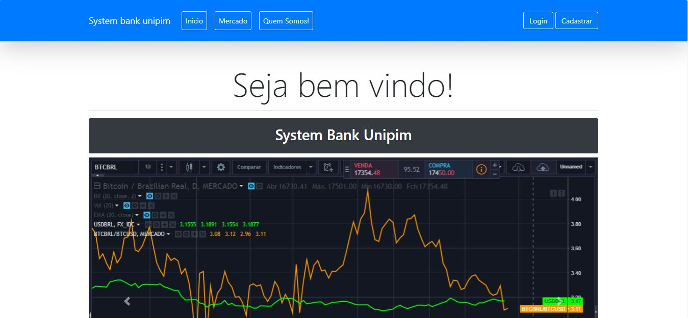
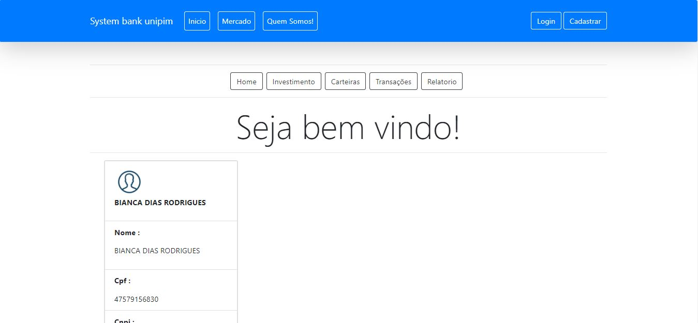

<!-- título -->
<h1 align="center">
  Sistema de gerenciamento - Crud
</h1>

<!-- status -->
<p align="center"><b>Status: Concluído ✅</b></p>

<!-- badges -->
<p align="center">
  
  
  <a href="https://www.linkedin.com/in/AllanSouzaSilva/">
    
  </a>
  
  
</p>

<!-- index -->
<p align="center">
  <a href="#-sobre">Sobre</a> •
  <a href="#-requisitos">Requisitos</a> •
  <a href="#-ferramentas">Ferramentas</a> •
  <a href="#-executando-o-projeto">Executando o projeto</a> •
  <a href="#-licença">Licença</a>
</p>

---
<!-- imagens-->
<h4 align="center">
  <p>Asp net web</p>
  
  
  <p>Tela cliente</p>
  
</h4>

---

## 📄 Sobre
O projeto consite em um sistema web baseado no crud, foi um projeto na onde tinha o objetivo de criar um sistema de gerenciamento para uma empresa superficila que trabalhava com o bitcoin. O sitema tem o objeto de criar, ler, atualizar e deletar os documentos e relatórios cadastrados, com isso  cada cliente tem um login de acesso na onde ele mesmo conseguiria gerenciar a sua conta de forma livre, a empresa superficial cujo o nome é SystemBankUnipim solicitou que cria-se um sistema desktop para gerenciar os clientes cadastrado no web. Esse projeto foi desenvolvido no nivel universitário que teria que ser entregue para completar a grade curricular e conclui-se o ensino superior. 

---

## 🔝 Requisitos

✅ - 

✅ -

✅-

✅ -

✅ -

✅ -

✅ -

✅ -

✅ -

---

### 🚀 Milha Extra

Funcionalidade além do solicitado

## 🔨 Ferramentas

Estas são as principais ferramentas utilizadas na construção do projeto:

- [.Net](https://docs.microsoft.com/en-us/dotnet/)
- [C#](https://docs.microsoft.com/en-us/dotnet/csharp/)
- [html](https://github.com/twbs)
- [Css](https://github.com/css)

---

## 🚀 Executando o projeto

Antes de qualquer coisa, você precisa ter o [Git](https://git-scm.com), o [Sql Server](https://www.microsoft.com/pt-br/sql-server/sql-server-downloads) e o [visual studio](https://visualstudio.microsoft.com/pt-br/downloads/) instalado na sua máquina. Feito isso, você pode prosseguir.

```bash
# Clone este repositório:
$ git clone linkdoprojeto

# Anexar o banco de dados:

o banco de dados se encontra na pasta banco de dados do projeto
Arquivo chamado SYSTEMBANKUNIPIM.mdf
Anexe o banco de dados no seu sql server antes.
atualize o banco e o identifique-o 

# Acesse à pasta do projeto:

SystemBankUnipim/SystemaBankUnipim
Clique no arquivo Systembankunipim
Abra solution no visual studio communit 2019
No arquivo do projeto chamado appsettings.json
troque a string de conexão. 

Ex:"Data Source=Seuservido;Initial Catalog=SYSTEMBANKUNIPIM;Integrated Security=True"

# Execute a aplicação em modo de desenvolvimento:
```
Caso a página não abrir automaticamente, acesse: http://localhost:44356
---
### 🚀 Milha Extra

Além do que foi pedido, adicionei animações para deixar a aplicação mais agradável e fluida, e também uma página exclusiva para tratativa de erros.

## 📋 Licença

## 🚀 Entre em contato!
---
Desenvolvido por [Allan Souza](https://www.linkedin.com/in/allan-souza-silva-794164146/).

